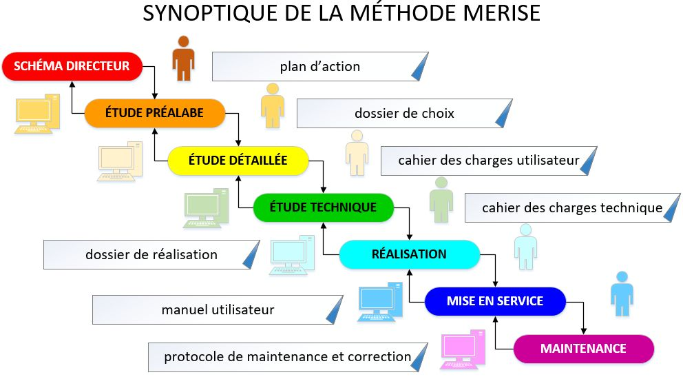
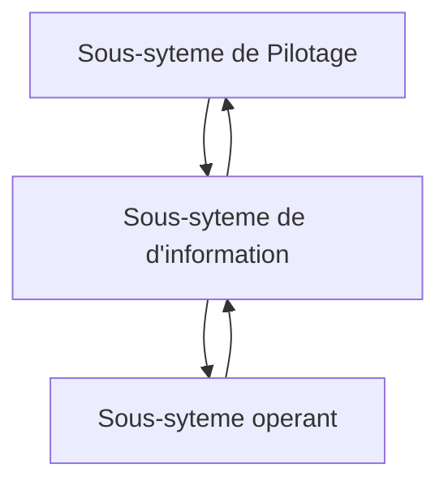
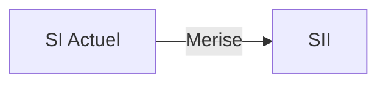
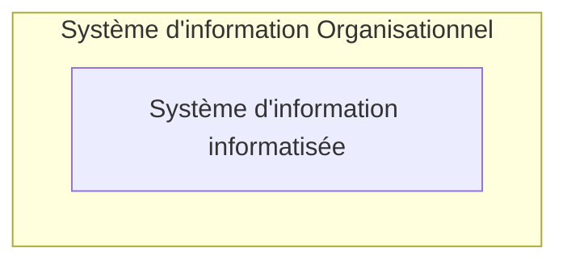
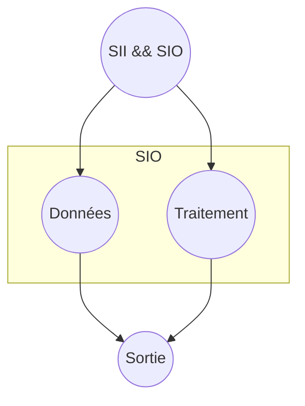
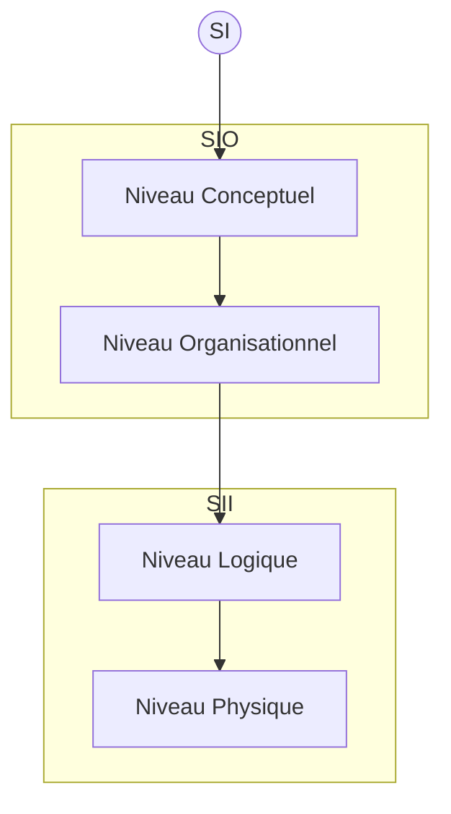

# I- MERISE
## A-Introduction
MERISE est une méthode de conception, de développement et de réalisation de projets informatiques. Elle sépare les données des traitements afin de s'assurer qu'il n'y ai pas des données superflues.

## C- Le schéma directeur
- objectifs
- stratégie
## D- L'étude préalable

- besoins macro
- les attentes
- traitements
## E- L'étude détaillée
- besoins micro
- les attentes
- traitements
## F- Merise en entreprise
**Système d'information vs Système d'information informatisée**

<!-- generated by mermaid compile action - START -->

  
Mermaid markup

<!-- generated by mermaid compile action - END -->
- Sous-syteme de Pilotage: reflexion, decision, controle.
- Sous-syteme de d'information: production, memorisation,comm, traitement ....
- Sous-syteme operant : transformation.

**Système d'information vs Système d'information informatisée**
<!-- generated by mermaid compile action - START -->

  
Mermaid markup

<!-- generated by mermaid compile action - END -->

**Système d'information informatisée vs Système d'information Organisationnel**
<!-- generated by mermaid compile action - START -->

  
Mermaid markup

<!-- generated by mermaid compile action - END -->

**Séparation données et traitement**
<!-- generated by mermaid compile action - START -->

  
Mermaid markup

<!-- generated by mermaid compile action - END -->

**Approche par niveau**

<!-- generated by mermaid compile action - START -->

  
Mermaid markup

<!-- generated by mermaid compile action - END -->
## B- Cycle d'abstraction (Modelisation)

<table>
    <thead>
        <tr>
            <th>Niveau</th>
            <th>Données</th>
            <th>Traitement</th>
            <th>Domaine</th>
        </tr>
    </thead>
    <tbody>
        <tr>
            <td>Niveau Conceptuel</td>
            <td>MCD</td>
            <td>MCT</td>
            <td rowspan=2>SIO</td>
        </tr>
        <tr>
            <td>Niveau Organisationnel</td>
            <td>MOD</td>
            <td>MOT</td>
        </tr>
        <tr>
            <td>Niveau Logique </td>
            <td>MLD</td>
            <td>MLT</td>
            <td rowspan=2>SII</td>
        </tr>
        <tr>
            <td>Niveau Physique</td>
            <td>MPD</td>
            <td>MPT</td>
        </tr>
    </tbody>
</table>

