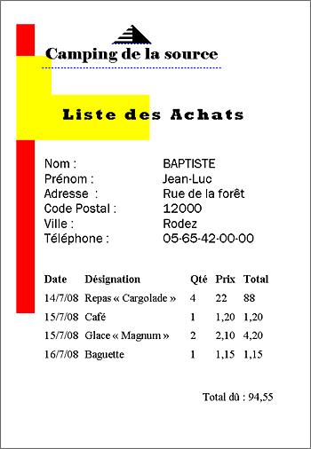
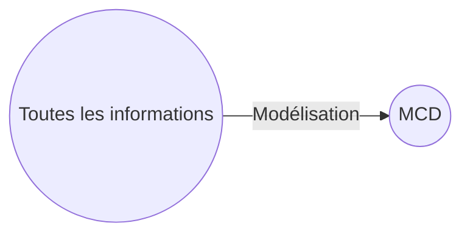
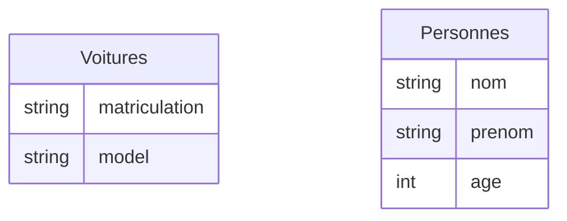
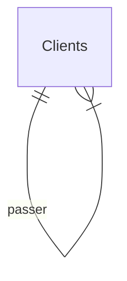
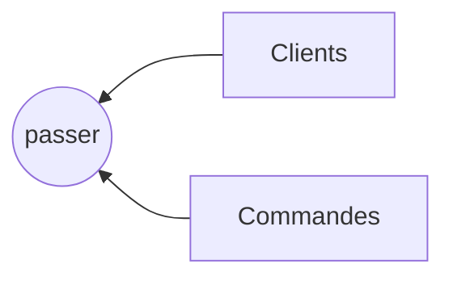
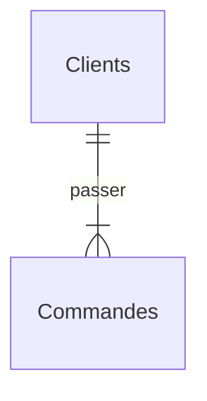
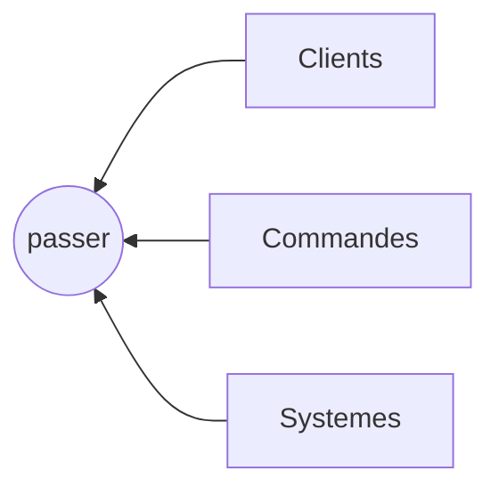
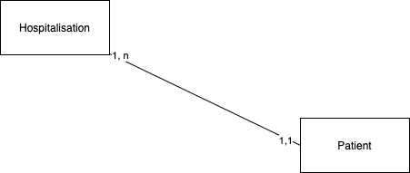

# Leçon 2: MCD

## I - Prérequis

### 1- Dictionnaire de données

<table>
    <thead>
        <tr>
            <th>Nom</th>
            <th>Format</th>
            <th>Longueur</th>
            <th>Type Elementaire</th>
            <th>Type Calculé</th>
            <th>R.Calcul</th>
            <th>R.Gestion</th>
            <th>Document</th>
        </tr>
    </thead>
    <tbody>
        <tr>
            <td>NomClient</td>
            <td>AlphaNumerique</td>
            <td>30</td>
            <td>X</td>
            <td></td>
            <td></td>
            <td></td>
             <td>Fiche</td>
        </tr>
    </tbody>
</table>

**<u>Exemple:</u>**
Remplir le dictionnaire des données à partir de la fiche ci-dessous.

| Nom                 |     Format     | Longueur | T Elementaire | T Calculé | R.Calcul                 | R.Gestion | Document |
| ------------------- | :------------: | -------: | ------------- | --------- | ------------------------ | --------- | -------- |
| idClient            | Alphanumerique |      100 | X             |           |                          |           |          |
| NomClient           | Alphanumerique |      100 | X             |           |                          |           |          |
| PrenomClient        | Alphanumerique |      100 | X             |           |                          |           |          |
| AdresseClient       | Alphanumerique |      100 | X             |           |                          |           |          |
| codePostalClient    | Alphanumerique |      100 | X             |           |                          |           |          |
| villeClient         | Alphanumerique |      100 | X             |           |                          |           |          |
| phoneClient         | Alphanumerique |      100 | X             |           |                          |           |          |
| idCommande        | Alphanumerique |      100 | X             |           |                          |           |          |
| DateCommande        | Alphanumerique |      100 | X             |           |                          |           |          |
| DesignationCommande | Alphanumerique |      100 | X             |           |                          |           |          |
| prixCommande        |   Numerique    |          | X             |           |                          |           |          |
| QteCommande         |   Numerique    |          | X             |           |                          |           |          |
| totalLigne          |   Numerique    |          |               | X         | prixCommande*QteCommande |           |          |
| TotalGlobale        |   Numerique    |          |               | X         | somme des totalLigne     |           |          |

### 2- Dépendances fonctionnelles

Connaissant idClient on peut identifier de façon unique (NomClient,PrenomClient, AdresseClient,  codePostalClient, villeClient, phoneClient)

idClient -> NomClient

idClient -> PrenomClient

idClient -> AdresseClient

idClient -> codePostalClient

idClient -> villeClient

idClient -> phoneClient

idClient -> (NomClient,PrenomClient,AdresseClient,codePostalClient,villeClient,phoneClient)

idCommande -> DesignationCommande

idCommande -> prixCommande

idCommande -> DesignationCommande, prixCommande

(idClient, idCommande, DateCommande) -> QteCommande

#### a- DF Elementaires
A -> B est une dependance fonctionnelle élementaire s'il n'existe pas de données C sous-ensemble de A tel que C -> B.

**<u>Exemple:</u>**
Etant donnée Produit(<u>Refproduit</u>, designation)

Refproduit ->designation

#### b- DF Elementaires Directes
A -> B 
est une dependance fonctionnelle élementaire directe(DFED) 
s'il n'existe pas de données C tel que A-> C et C -> B.

ie DF(A,B) ne peut pas être obtenue par transitivité.

**<u>Exemple:</u>**
étant donnée que 
numClass->NumEleve est une DFED et NumEleve -> NomEleve DFED 

=> numClass ->NomEleve n'est pas une DFED.

#### a- DF Composées
Une DFC est DF avec plusieurs attributs

**<u>Exemple:</u>**
Etant donné Course(<u>NumCoureur</u>, <u>Numcourse</u>, temps)

=> (NumCoureur, Numcourse) -> temps

**<u>Exercice:</u>**
Monique, sa fille Rachel et son gendre Marc gèrent un camping dans les Pyrénées orientales. Le camping est ouvert du 1er juin au 30 septembre. Ils disposent de cinquante emplacements sur un terrain d’une superficie totale de quarante hectares.

Ils sont équipés d’un logiciel spécialisé dans la réservation des emplacements qui fonctionne très bien mais qui ne permet pas de gérer les achats de l’épicerie ou du bar selon leurs règles de gestion. En effet, les vacanciers ne payent leurs achats qu’à la fin de leur séjour. Concrètement, les achats sont inscrits manuellement sur une fiche bristol créée pour chaque famille de vacanciers. À la fin du séjour, les cumuls sont réalisés et une facture manuelle concernant les achats est établie. Les propriétaires du camping souhaiteraient disposer d’un logiciel permettant d’automatiser la création de la facture grâce à la saisie journalière des achats.

## II - MCD

### 1- Entités

C'est un objet ayant une existance propre dans le domaine d'existance.
- <u>Formalisme</u>: un carré avec nom au pluriels. comme dans l'exemple ci-dessous.

### 2- Attributs/champs

Ce sont des élements propres à une entité.
- <u>Formalisme</u>: TYPE: NOM

- <u>identifiant</u> : attribut spécial tel que si entite(identifiant, attibut1, attribut2, ...)
=> identifiant->(attibut1, attribut2, ...)

### 3- Associations/Rélations

Ils représentent le lien entre les entités.

- <u>Formalisme</u>: ils sont representer par un verbe à l'infinitif.

- association 1-naire (reflexive) : une entité est en relation avec elle même comme.

- association binaire : une entité est en relation avec une seule autre entité comme.

- association n-aire (ternaire avec 3 entités)  : une entité est en relation avec une seule autre entité comme.

- association porteuse: des associations avec des propriétées
### 4- Cardinalités

Ils permettent d'indiquer les nombres d'occurence maxi et mini des entités impliquées dans l'association.
- <u>Formalisme</u>: MIN, MAX
- types de cardinalités

|                          | Cardinalités | autres notations |
| ------------------------ | :----------: | ---------------: |
| unique (Obligatoires)    |     1,1      |              1,1 |
| Plusieurs (Obligatoires) |     1,n      |              1,* |
| unique (Optionnel)       |     0,1      |              0,1 |
| Plusieurs (Optionnel)    |     0,n      |                * |

## III- [Etude de cas:](exercice.md)

Mettre en place pour l'étude de cas n°1
* DD
* DF
* MCD